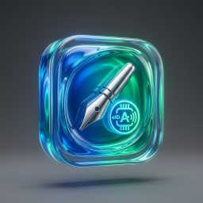
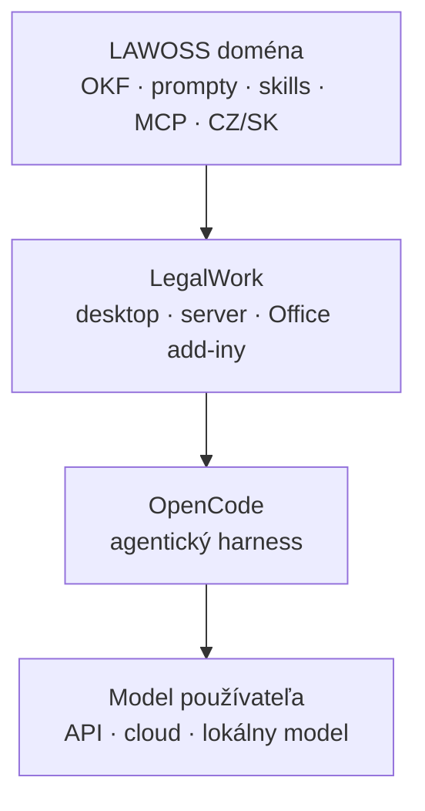

<div align="center">


# LAWOSS

### Czechia · Slovakia

**Open-source AI pracovné prostredie pre českých a slovenských advokátov**

*Poriadok v spise. Overené právo. AI pod kontrolou.*

[](https://github.com/originalmagneto/lawOSS-like-SK-CZ/blob/main/planning/roadmap.md)
[](https://github.com/eigenweltlabs/legalwork)
[](LICENSE)
[](https://github.com/originalmagneto/lawOSS-like-SK-CZ/blob/main/docs/vision.md)


</div>

> [!IMPORTANT]
> LAWOSS je v aktívnom vývoji a zatiaľ nemá vlastné produkčné binárky. Nepoužívajte testovacie buildy s klientskymi, privilegovanými ani spisovými dátami bez vlastného bezpečnostného posúdenia.

## Aktuálne odovzdanie

[Logo B a jednotný sidebar — technický zápis, testy a preview z 10. 9. 2026](docs/2026-09-10-logo-b-sidebar-handoff.md).

## Čo je LAWOSS

Voice Mode po spustení prenáša mikrofónový zvuk a výňatok aktuálneho chatu do OpenAI Realtime cez pripojený OpenAI API kľúč. Recorder a systémové diktovanie transkribujú lokálne. Podrobnosti o prenose dát a voliteľnej telemetrii sú v [TERMS.md](TERMS.md).

LAWOSS je česká a slovenská open-source vrstva nad projektom [LegalWork](https://github.com/eigenweltlabs/legalwork). Spája lokálne agentické pracovné prostredie s právnymi workflowmi, otvorenými promptmi, skills a MCP konektormi pre naše jurisdikcie.

Základom zostáva upstream LegalWork. Všeobecne použiteľné opravy a lokalizácie chceme ponúkať späť upstreamu. Naše právne workflowy držíme v samostatných adresároch, aby zostali prenositeľné a aby bol fork dlhodobo udržateľný.

| | |
|---|---|
| **Organizácia** | [Omni Legal Products](https://github.com/Omni-Legal-Products) |
| **Koordinácia a rozhodnutia** | [lawOSS-like-SK-CZ](https://github.com/originalmagneto/lawOSS-like-SK-CZ) |
| **Produktový kód** | tento repozitár |
| **Upstream** | [eigenweltlabs/legalwork](https://github.com/eigenweltlabs/legalwork) |
| **Licencia** | MIT, so zachovanou atribúciou Eigenwelt Labs |

## Päť pilierov

| | |
|---|---|
| 📂 **Inteligentné spisy a úlohy** | OKF štruktúra, validácia a lehoty pod kontrolou |
| 🎙️ **Transkripcia a zápisy** | Lokálne spracovanie a prepojenie so spisom |
| ⚖️ **Overené právne zdroje CZ a SK** | Slov-Lex, judikatúra a registre cez MCP |
| 🔓 **Otvorený prompt layer** | Žiadny black box, verzované prompty a skills |
| 🔒 **Lokálne dáta a bezpečnostné brány** | Advokát zostáva rozhodujúcim človekom v procese |

## Čo staviame ako prvé

LegalWork už poskytuje chat, lokálneho agenta, Office add-iny, transkripciu a správu MCP serverov. LAWOSS sa preto sústreďuje na to, čo z neho robí nástroj pre českého a slovenského advokáta.

| Oblasť | Cieľ |
|---|---|
| 🇸🇰🇨🇿 **SK a CZ lokalizácia** | Kompletné rozhranie a právne názvoslovie pre obe jurisdikcie |
| 📁 **OKF** | Zakladanie a udržiavanie štruktúrovaných spisov |
| 🔌 **Právne MCP konektory** | Judikatúra, Slov-Lex a ďalšie overené zdroje |
| ⏰ **Lehoty a timeline** | Kontrolovaný výpočet a evidencia lehôt s potvrdením advokáta |
| 📄 **OCR ingest** | Prevod dokumentov do čistého, agenticky použiteľného Markdownu |

Podrobný scope, ADR a špecifikácie sú v [koordinačnom repozitári](https://github.com/originalmagneto/lawOSS-like-SK-CZ).

## Autogram — podpisovanie a zaručená konverzia

<table>
<tr>
<td width="120" valign="top"></td>
<td valign="top">

**[Autogram macOS](https://github.com/originalmagneto/autogram-macOS)** je samostatná natívna aplikácia v SwiftUI od rovnakého autora. **Funguje už dnes a používa sa nezávisle od LAWOSS** — nie je to pripravovaná funkcia tohto projektu.

| Modul | Čo rieši |
|---|---|
| **Podpisovanie** | KEP, PAdES, ASiC-E, kvalifikovaná časová pečiatka, grafický podpis, dávkové spracovanie |
| **Zaručená konverzia** | Postup podľa zák. č. 305/2013 Z. z. s detekciou bezpečnostných prvkov, osvedčovacou doložkou a autorizáciou mandátnym certifikátom |
| **Štátne weby** | Rozšírenie do Safari, ktoré podpisovanie na portáloch obslúži cez aplikáciu — potvrdenie kartou alebo mobilom |
| **Register** | Lokálna evidencia konverzií, stavy, vyhľadávanie a CSV export |

</td>
</tr>
</table>

**Čo z toho má LAWOSS dnes:** v nastaveniach v sekcii *Integrations* je karta, ktorá na macOS zistí, či máte Autogram nainštalovaný, a podľa toho ho otvorí alebo odkáže na jeho vydania. **Hlbšie prepojenie sa pripravuje** — LAWOSS zatiaľ Autogramu neodovzdáva dokumenty ani neriadi jeho beh.

> [!NOTE]
> Autogram je samostatný projekt s vlastným repozitárom a vlastným životným cyklom. Nie je súčasťou tohto forku a nevzťahuje sa naň licencia LAWOSS.

## Vizuálny smer

> [!NOTE]
> Nasledujúce obrázky sú koncepty, nie snímky hotového produktu. Dáta v nich sú vymyslené.

<div align="center">


<br><br>


</div>

## Architektúra rozšírení



Pracujeme v troch zónach:

| Zóna | Obsah | Pravidlo |
|---|---|---|
| 🟢 **Naše adresáre** | `lawoss/**`, CZ/SK locale a dokumentácia | Prednostné miesto pre našu prácu |
| 🟡 **Evidované zásahy** | Branding, registrácia locale a nevyhnutné upstream úpravy | Každá zmena patrí do [`PATCHES.md`](PATCHES.md) |
| 🔴 **Zakázaná zóna** | LegalMemory AGPL plugin, extension registry, svojvoľný bump OpenCode | Zmena iba po novom ADR |

## Tím

| Člen | Zameranie |
|---|---|
| [Marián Čuprík](https://github.com/originalmagneto) | SK jurisdikcia, integrácie a upstream sync |
| [Martin Friedrich](https://github.com/LexaurinTheDog) | Lehoty, právne workflowy a bezpečnostné brány |
| [Igor Ribár](https://github.com/igorribar) | Advokátska prax a produktové overovanie |
| [Vojta Říha](https://github.com/BiggusDicckkus) | CZ jurisdikcia, lokalizácia a technické návrhy |

## Vývoj

Základné požiadavky upstreamu: Node.js, `pnpm@11.4.0`, Bun 1.3.9+ a OpenCode CLI. Platformové požiadavky a aktuálny onboarding sledujte podľa upstream dokumentácie a build workflowov.

```bash
pnpm install
pnpm dev
```

Pred otvorením PR spustite minimálne:

```bash
pnpm typecheck
pnpm test:e2e
```

Prečítajte si [`AGENTS.md`](AGENTS.md). Každá zmena ide cez krátku vetvu, pull request, jedno schválenie a zelené CI. Pri zásahu do upstream súboru aktualizujte v tom istom PR aj [`PATCHES.md`](PATCHES.md).

- [Build pre alfa testerov](docs/lawoss-build-pre-testerov.md) — ako si aplikáciu skompilovať a čo hlásiť

## Bezpečnosť a modely

- Free modely poskytované upstreamom logujú používanie. Sú určené iba na testovanie bez klientskych a spisových dát.
- Produkčné používanie musí mať vlastný schválený model alebo vlastný API kľúč.
- Telemetria upstream buildov je opísaná v [`TERMS.md`](TERMS.md) a dá sa vypnúť.
- LAWOSS neposkytuje právne poradenstvo a nenahrádza odborné rozhodnutie advokáta.

## Pôvod a licencia

LAWOSS je fork projektu [LegalWork](https://github.com/eigenweltlabs/legalwork), pôvodne vytvoreného spoločnosťou Eigenwelt Labs. Pôvodná MIT licencia zostáva zachovaná v [`LICENSE`](LICENSE) a atribúcia je uvedená v [`NOTICE`](NOTICE).

Ďakujeme tímom Eigenwelt Labs, OpenCode a Different AI za prácu, na ktorej tento projekt stavia.
