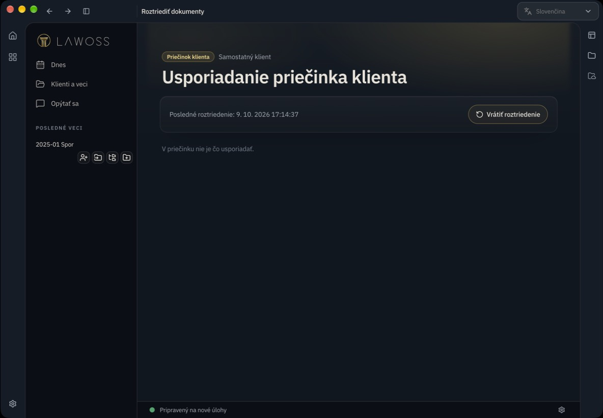
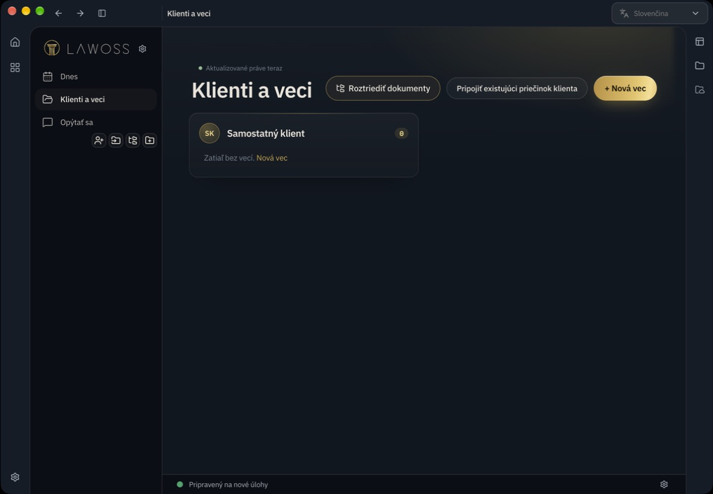
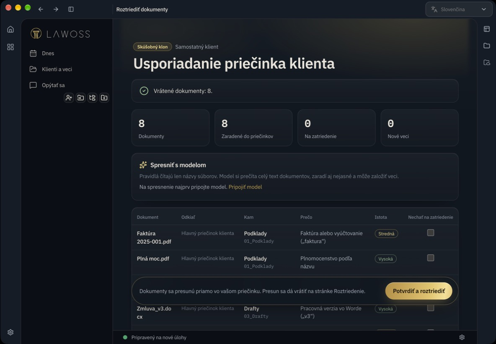
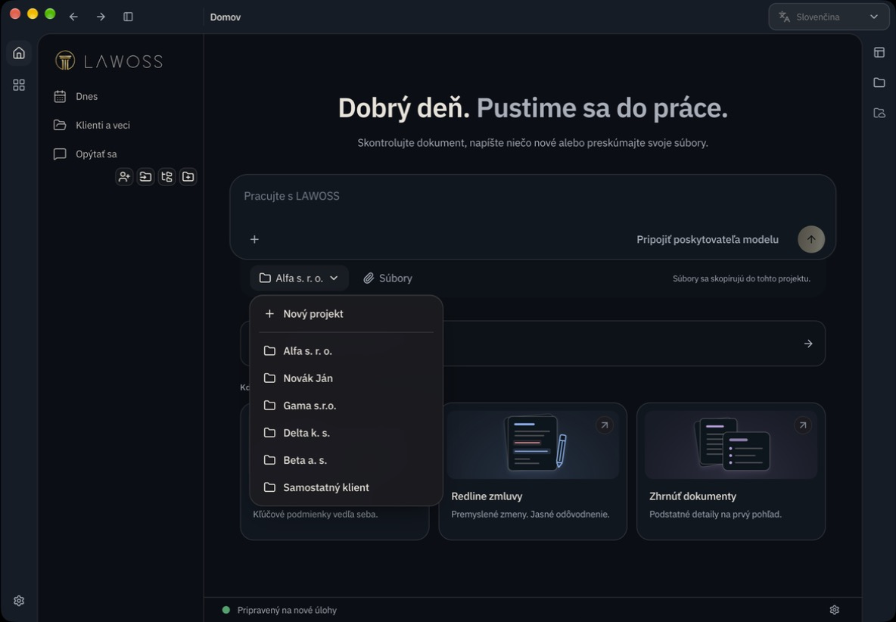

# D1 onboardingu cez pripojenie priečinka, 9. 10. 2026

Akceptačný beh plánu C2 (úloha 9) na zabalenej appke z vetvy `feat/onboarding-c2`. Spec: [lawOSS-like-SK-CZ#92](https://github.com/Omni-Legal-Products/lawOSS-like-SK-CZ/pull/92). Plány A, B, C1 a C2: [lawoss#134](https://github.com/Omni-Legal-Products/lawoss/pull/134).

## Prostredie

- macOS arm64, `LAWOSS.app` z `pnpm --filter @legalwork/desktop package:electron:dir`.
- Každý beh na čistom profile: vlastné `HOME`, `XDG_*` a `LEGALWORK_ELECTRON_USERDATA` v scratchpade, `LEGALWORK_DESKTOP_DISABLE_WORKSPACE_RECOVERY=1`. Všetky procesy LAWOSS mali `HOME` v scratchpade.
- Po každom behu: `pgrep -fl "MacOS/LAWOSS"` vypísal „nič nebeží“ a `find ~/.config/legalwork ~/.config/opencode ~/.legalwork -newer marker` bol prázdny. Skutočný profil ostal nedotknutý.
- Appka sa zatvárala iba cez `osascript -e 'tell application id "com.eigenweltlabs.legalwork" to quit'`, nikdy cez `pkill`.
- Iba vymyslené údaje: `Prax/` so 6 klientmi (`Alfa s. r. o.`, `Beta a. s.`, `Gama s.r.o.`, `Delta k. s.`, `Novák Ján/2024-03 Kúpna zmluva`, `Zamknutý klient`), `Samostatný klient/` s 8 dokumentmi a vecou `2025-01 Spor/Žaloba.pdf`, prázdny `Nová prax/`.
- Bez modelu (krok AI preskočený cez „Pokračovať bez modelu“).

## Prvé spustenie

| Profil | Build | Timeouty pri štarte (`failed after`) | Výsledok |
|---|---|---|---|
| e-dev | `origin/dev` `c7490d4f` | 0 | PASS, onboarding |
| e-b | B samotné (`feat/ai-bez-priecinka` `4be9f64e`) | 0 | PASS, onboarding |
| d1 | C2 `b4a40a4c` | 7 | **FAIL.** Dnes v lite s hláškou „Your matters could not be loaded“, aj po View > Reload.  |
| d2 | C2 + presmerovanie z úvodnej stránky | 0 | **FAIL.** `/welcome` s „LAWOSS server is unavailable“, aj po znovunačítaní, hoci server počúval a odpovedal. Presmerovanie prebehne skôr, než boot zverejní server, a stránka sa pripájala jediný raz.  |
| d3 | C2 + presmerovanie + `/welcome` čaká na server | 15 | **PASS.** Onboarding sa otvoril krokom 1 a prešli všetky tri cesty.  |

Oprava sú dva commity na `feat/onboarding-c2` (pôvodne [lawoss#144](https://github.com/Omni-Legal-Products/lawoss/pull/144), zatvorený): úvodné stránky `/dnes` a `/home` povolia presmerovanie na `/welcome` pri prvom spustení (`firstRunRedirect`) a `/welcome` čaká na udalosť `legalwork-server-settings-changed` (`lawoss/domains/onboarding/server-connection.ts`). Na `dev` ani v B sa chyba neprejavila. Mechanizmus pri C2 nie je určený. Behy C2 mali pri prvom štarte 7 až 15 timeoutov, `dev` a B ani jeden. Ponechávam to ako nález pre tím.

Ukončenie appky skončilo SIGTRAP (exit 133) vo všetkých behoch B a C, `dev` sa ukončil čisto (exit 0). Príčina je opravená na `dev` v [lawoss#141](https://github.com/Omni-Legal-Products/lawoss/pull/141) (`c7490d4f`, stráž navigácie volala `stop()` počas shutdown obrazovky). Vetvy A, B a C sú staršie ako táto oprava a dostanú ju po aktualizácii z `dev`.

## Overenie opráv P1 (profil d4, build `32ca4699`)

Čistý izolovaný profil, 0 timeoutov pri štarte. Onboarding sa otvoril, cesty 1 a 2 som zopakoval s rovnakými syntetickými dátami. Výsledky sú pri jednotlivých krokoch nižšie.

## Overenie opráv P3 (profil d5, build `e3929ca6`, ad-hoc podpis)

Čistý izolovaný profil, 0 timeoutov. Cesta 1 až po Klienti a veci a stránku Roztriedenie, výsledky pri krokoch nižšie.

## Cesta 1: Klient (profil d3)

Ty a jurisdikcia → Dáta a AI (Pokračovať bez modelu) → Priečinok → Pripojiť existujúci → `Samostatný klient`.

| Krok | Výsledok |
|---|---|
| „Toto som našiel“: návrh „klient“ | PASS  |
| „Áno, usporiadaj“: OKF súbory vzniknú pred náhľadom | PASS: `AGENTS.md`, `CLAUDE.md`, `client.md`, `memory/` a štruktúra `00_` až `05_` |
| `_STATUS.md` z riadku „Pribudne“ | **FAIL:** súbor nevznikol, hoci ho obrazovka sľubuje |
| Vložený panel náhľadu presunov | PASS: 9 dokumentov, dôvod, istota, „Nechať na zatriedenie“ a lišta „Potvrdiť a roztriediť“. Stĺpec Dokument je úzky a lame názvy uprostred slova.  |
| Tlačidlo pod náhľadom | V prvom spustení je to „Dokončiť“. „Zrušiť“ je iba v toku z bočného panela (pozri nižšie).  |
| Potvrdiť a roztriediť | PASS: dokumenty sú v `01_Podklady`, `03_Drafty`, `04_Vystupy`, `05_Komunikacia` a `05_Komunikacia/Dolezita_posta`; klient je zaregistrovaný ako workspace |
| Vec `2025-01 Spor` | d3 **FAIL:** `Žaloba.pdf` sa presunula z priečinka veci do `04_Vystupy` klienta. **Opravené `ff009a0f`, d4 PASS:** náhľad má 8 dokumentov a `Žaloba.pdf` ostane v `2025-01 Spor`. **Po `e3929ca6`, d5 PASS:** Klienti a veci ukazujú `2025-01 Spor` ako vec klienta aj bez karty a stránka veci sa otvorí.   |
| Appka po dokončení | Otvorí Domov s vybraným projektom „Samostatný klient“, nie stránku klienta |
| „Vrátiť“ na stránke Roztriedenie | d3 **FAIL:** pri usporiadaní na mieste chýbal vstup. **Opravené `32ca4699`, d4 PASS:** Klienti a veci majú „Roztriediť dokumenty“, stránka ukáže posledné roztriedenie a „Vrátiť roztriedenie“ vrátil 8 dokumentov na pôvodné miesta. Štítok „Skúšobný klon“ je po `0d959f72` „Priečinok klienta“ (d5).    |

## Tok z bočného panela

| Krok | Výsledok |
|---|---|
| „Usporiadať podľa OKF“ pri už usporiadanom klientovi | Otvorí „Toto som našiel“ bez „Zrušiť“. Päta je počas tejto obrazovky zámerne skrytá (`lawoss-welcome-page.tsx`). Východ vedie cez „Vybrať iný priečinok“ na krok Priečinok a až tam je „Zrušiť“, teda na dve kliknutia. |
| „Zrušiť“ na kroku Priečinok | PASS: vráti na Klienti a veci |

## Cesta 2: Prax (profil d3)

Bočný panel → Pridať priečinok → Pripojiť existujúci → `Prax`.

| Krok | Výsledok |
|---|---|
| Návrh „celá prax: 6 klientov“, predvolené „Každý klient zvlášť“ | PASS  |
| Odznačiť `Zamknutý klient` → „Nie, len pridaj OKF súbory“ | PASS: súhrn „Hotovo: 5 z 5“  |
| Súbory na disku | PASS: 5 klientov má `AGENTS.md`, `client.md`, `memory/`. `Zamknutý klient` ostal nedotknutý. Vznikol `Prax/Office/` a `Prax/AGENTS.md` neobsahuje mená klientov. |
| 5 klientov v appke | d3 **FAIL:** zaregistrovaný bol iba `Alfa s. r. o.` ([snímka](assets/d1-onboarding-priecinok-2026-10/09-prax-klienti-len-alfa.jpg)). **Opravené `6cd066af`, d4 PASS:** všetkých 5 klientov je zaregistrovaných, každý má skilly OKF a výber projektu ich ukazuje.  |
| `lawoss-domov` | PASS: nikde v UI |

## Cesta 3: Začať nanovo (profil d3)

Bočný panel → Pridať priečinok → Začať nanovo → `Nová prax`.

| Krok | Výsledok |
|---|---|
| Zápis kancelárie | PASS: `AGENTS.md`, `CLAUDE.md`, `Office/` (`okf.config`, `memory/`), `Klienti/` |
| Návod na migráciu | PASS: „Klientov sem skopírujte… a v bočnom paneli zvoľte Pridať priečinok“. Po dokončenom zápise ostáva viditeľné aj „Zrušiť“.  |
| Karta Začať nanovo | Riadok „Pribudne“ vypisuje súbory klienta (`client.md`), nie kancelárie (známa odložená drobnosť) |
| Skopírovať `Samostatný klient` do `Nová prax/Klienti/` → Pridať priečinok → klient → „Nie“ | PASS: pribudli OKF súbory, nič sa nepohlo (`Žaloba.pdf` ostala v `2025-01 Spor`) a klient je zaregistrovaný |
| Názvy workspace | Dva rôzne priečinky majú rovnaký názov „Samostatný klient“ a v UI sa nedajú rozlíšiť |

## Súhrn nálezov

| Priorita | Nález | Stav |
|---|---|---|
| P0 | Čistá inštalácia neotvorí onboarding (d1, d2) | Opravené na `feat/onboarding-c2`, overené v d3 |
| P1 | Usporiadanie klienta rozpustí existujúcu vec (`2025-01 Spor`) | Opravené `ff009a0f`, overené v d4 |
| P1 | Prax „Každý klient zvlášť“ zaregistruje iba prvého klienta | Opravené `6cd066af`, overené v d4 |
| P1 | „Vrátiť“ po usporiadaní na mieste nemá v lite vstup | Opravené `32ca4699`, overené v d4 |
| P2 | `_STATUS.md` sľúbený, ale nevznikne | Otvorené |
| P2 | „Usporiadať podľa OKF“ z bočného panela bez priameho „Zrušiť“ | Otvorené |
| P2 | Pomalý prvý štart buildov C (7 až 15 timeoutov, `dev` a B 0) | Na diagnostiku |
| P3 | Stránka Roztriedenie pri usporiadaní na mieste píše „Skúšobný klon“ | Opravené `0d959f72`, overené v d5 |
| P3 | Priečinok veci bez karty sa v Klientoch a veciach neukáže ako vec | Opravené `e3929ca6`, overené v d5 |
| P3 | Úzky stĺpec Dokument v náhľade, „Zrušiť“ po dokončenom zápise, rovnaké názvy workspace | Otvorené |
