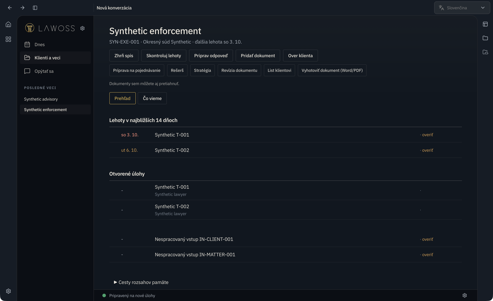
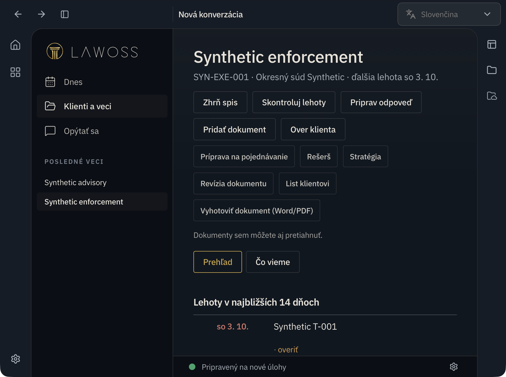
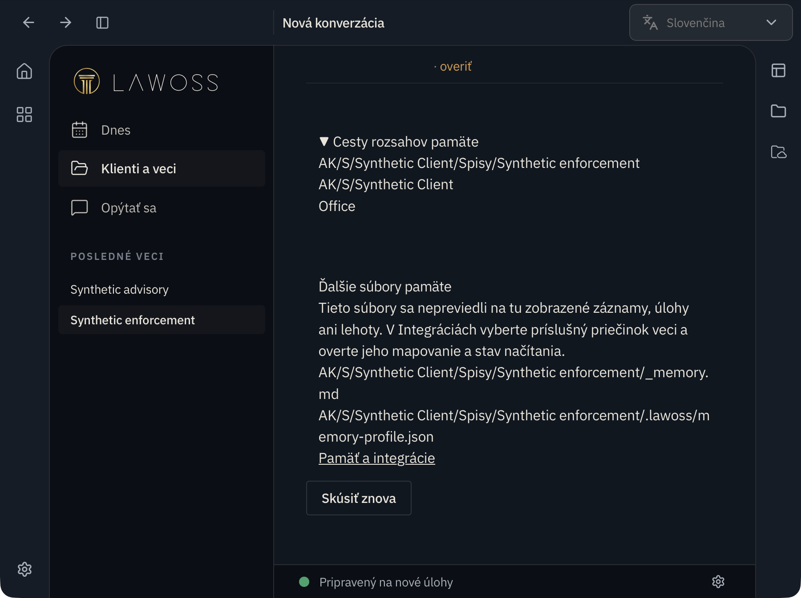

# OKF integrácia po LegalWork v0.2.1

Dátum: 3. 10. 2026. Integračná vetva `feat/okf-integration`, základ `39a27747` po merge sync PR #102. Toto je výsledok integrácie a overenia, nie nová špecifikácia ani schválenie otvorených návrhov.

## Začlenené PR

| Zdroj | Stav pri kontrole | Výsledok integrácie |
|---|---|---|
| [Produkt #99](https://github.com/Omni-Legal-Products/lawoss/pull/99), `caacdf9` | Otvorené PR Vojtěcha Říhu | Jazyk požiadavky pre asistenta SK/CS/EN/DE, český skill, predvolená jurisdikcia podľa UI so zachovaním ručnej voľby. Nadväzuje na [koordinačné #84](https://github.com/Omni-Legal-Products/lawOSS-like-SK-CZ/pull/84). |
| [Produkt #100](https://github.com/Omni-Legal-Products/lawoss/pull/100), `617dc38` | Otvorené PR Vojtěcha Říhu | Jednoduchý režim, Dnes, klienti/veci, rýchle akcie ako koncepty, import a zrozumiteľná karta zápisu. PR uvádza schválený návrh LAWOSS-lite z 23. 9.; výslovne vylučuje onboarding F4. |
| [Produkt #101](https://github.com/Omni-Legal-Products/lawoss/pull/101) | Samostatné následné upratovanie | Nezačlenené. Pre túto funkčnú integráciu nie je potrebné. |
| [Produkt #98](https://github.com/Omni-Legal-Products/lawoss/pull/98) | Samostatné bezpečnostné zmeny | Nezačlenené do tejto vetvy. Vyžadujú vlastné posúdenie. |
| [Produkt #79](https://github.com/Omni-Legal-Products/lawoss/pull/79) | Starší návrh informácií o AI | Nepovažuje sa za splnenie novšieho návrhu runtime pravidiel v koordinačnom #88. |

## Porovnanie s pripomienkami MČ

Zdroje rozhodnutí zostávajú v koordinačnom repozitári: [pripomienky 20. 9.](https://github.com/Omni-Legal-Products/lawOSS-like-SK-CZ/blob/main/planning/2026-09-20-okf-pripomienky-mc.md), [review 22. 9.](https://github.com/Omni-Legal-Products/lawOSS-like-SK-CZ/blob/main/planning/2026-09-22-okf-review-po-merge.md), [onboarding #85](https://github.com/Omni-Legal-Products/lawOSS-like-SK-CZ/pull/85), [AI governance #88](https://github.com/Omni-Legal-Products/lawOSS-like-SK-CZ/pull/88).

| Požiadavka | Overený stav | Zostáva |
|---|---|---|
| Úplná kanonická pamäť veci, klienta a kancelárie | Číta sa typovaná pamäť v rozsahu; kanonický validátor hlási chyby vrátane neplatných väzieb. Detail zobrazuje cesty rozsahov. | Ľubovoľné existujúce súbory nie sú automaticky prevedené na typované úlohy/lehoty. Detail na ne upozorňuje. Rýchle akcie ešte nepredstavujú dokončený jednotný tok pre oba pamäťové protokoly. |
| Pravdivý stav pri poškodených/neúplných dátach | Chyby validácie vstupujú do upozornení a bránia `okfValid`. Neúplný výpis a chyby čítania zostávajú viditeľné. | Zelená technická validácia nepotvrdzuje správnosť právneho posúdenia. |
| Rozsah klient verzus vec | Klientsky `VSTUPY.md` sa dedí, v Dnes sa deduplikuje a nesie klientsky odkaz/označenie. Chyba čítania sa ukáže aj v detailoch vecí. | Plný klientsky intake workflow patrí do onboardingu. |
| Zachovať oprávnenia | Otvorenie rozhovoru nad vecou už potichu nepridáva nadradené adresáre medzi povolené. Integrácie a oprávnenia sú dostupné aj v Lite. | Reálny rozhovor v desktop aplikácii musí overiť natívnu žiadosť o chýbajúce povolenie. |
| Profil pracovných priečinkov | Import používa uložený `PRACOVNY-PROFIL.md` a jeho inbox. Chybný profil blokuje import pred zápisom. Starší spis bez profilu používa existujúci predvolený inbox. | Natívne úvodné nastavenie kancelárie podľa #85 nie je implementované týmto PR. |
| Originály a súbežný import | Binárny zápis je create-only. Konflikt registra sa raz obnoví bez opakovania binárneho zápisu. Pri zlyhaní zostane uvedená cesta uloženého originálu. | Po neúspešnej registrácii je potrebné originál manuálne zaradiť; automatické mazanie sa nevykonáva. |
| Lehoty a zdieľané úlohy | Vyradené záznamy sa nepočítajú, zdieľané úlohy sa deduplikujú, kandidáti zostávajú označení na overenie. | Živé právne výpočty a kontrola podkladov advokátom. |
| Poradenské a priebežné veci | Existujúci doménový model ich podporuje; regresie prechádzajú. Checkpoint teraz podporuje aj riadne typovanú projektovú kartu. | Desktop end-to-end skúška s reálnym modelom. |
| Overenie registrov | Formulár a prompty rozlišujú krajinu, subjekt a identifikátor; neoverený výsledok sa nesmie vydávať za AML. | Automatické adaptéry s dôkazom zdroja/času a reálne overenie ORSR/RPO/ARES neboli týmto PR dodané ani testované. |
| Evidencia komunikačných kanálov | Existujúca evidencia zostáva súčasťou spisu. | Nie je to aktívny monitor schránok. |
| Checkpoint pamäte | Testovaný idle/compaction/turn handoff, explicitná identita veci; projektové aliasy s protichodným typom sa odmietajú. | Nie je overený živý beh konkrétneho poskytovateľa AI. |
| Mapovanie / konverzia / skúšobná kópia | Existujúca natívna karta mapovania ostáva dostupná. | Ucelený výber a sprievodca podľa #85, najmä pripojenie bez zásahu do originálov, zostávajú samostatná implementácia. |
| SAK/ČAK pravidlá používania AI | Existujúce hranice oprávnení sa zachovali. | #88 požaduje runtime obmedzenia podľa poskytovateľa a údajov. Informačný panel #79 tento kontrakt nenahrádza. |

## Integračné opravy

Štyri konflikty PR #100 s v0.2.1 boli vyriešené v prospech nového natívneho shellu. Zachovaný je panel projektov, action rail a nastavenia. Pokročilý režim smeruje na upstream `/home`; Lite na `/dnes`. Lite skrýva pokročilé akcie v novom raili, ponecháva projekty, Integrácie, Permissions, Updates a identitu upravovaného projektu. Zásahy do upstream súborov sú v `PATCHES.md`.

Regresný test s pevnými septembrovými lehotami bol opravený na termíny relatívne k dnešnému dňu. Nové texty používajú obyčajnú pomlčku a kontrola slovníkov pokrýva EN/DE/SK/CS.

## Overenie

Node `24.19.0`, pnpm `11.4.0`, závislosti nainštalované cez `pnpm install --frozen-lockfile`. Bez zmeny lockfile.

| Príkaz | Výsledok |
|---|---|
| `pnpm --filter @legalwork/app test` | 1 136 pass, 0 fail; 166 súborov. Vrátane 3 nových testov importu cez skutočný server. |
| `pnpm --filter @legalwork/app typecheck` | Bez TypeScript chýb. |
| `pnpm --filter @legalwork/app test:i18n` | 5 665 EN kľúčov, EN/DE/SK/CS kompletné. |
| `pnpm --filter @lawoss/okf-pamat test` | 603 pass, 0 fail. |
| `bun test lawoss/okf/test lawoss/okf-handoff apps/app/scripts/lite-smoke.test.mjs apps/server/src/lawoss-register-existing.e2e.test.ts` | 205 pass, 0 fail. |
| `pnpm --filter @legalwork/app build` | Úspešný produkčný build, 1 min 11 s; upozornenia na veľkosť chunkov a anotácie závislostí. |

Safari: skutočný lokálny LAWOSS server, syntetická kancelária s dvoma vecami a náhradný engine bez AI poskytovateľa. Overené Dnes, klientsky vstup iba raz, detail veci, upozornenie na ďalšie pamäťové súbory, natívne Integrácie a oprávnenia, prepnutie SK/CS a zachovanie ručne zvolenej CZ jurisdikcie pri návrate na SK UI. Kontrola prebehla aj pri zúženom okne; obsah detailu nemal horizontálny overflow. Po oprave starej adresy syntetického servera v testovacom browser profile boli finálne konzolové chyby a HTTP zlyhania prázdne. Vizuálny dôkaz je v `docs/images/okf-integration/`. Žiadne klientské dokumenty ani cloudový model neboli použité.

Browser skúška nie je dôkazom end-to-end desktop rozhovoru, reálneho MCP overenia registra, macOS/Windows packagingu ani schválenia právneho výsledku. Pred merge zostáva požadované CI a ľudské review. Táto integračná vetva nemení stav ani schválenie zdrojových PR #99/#100.

