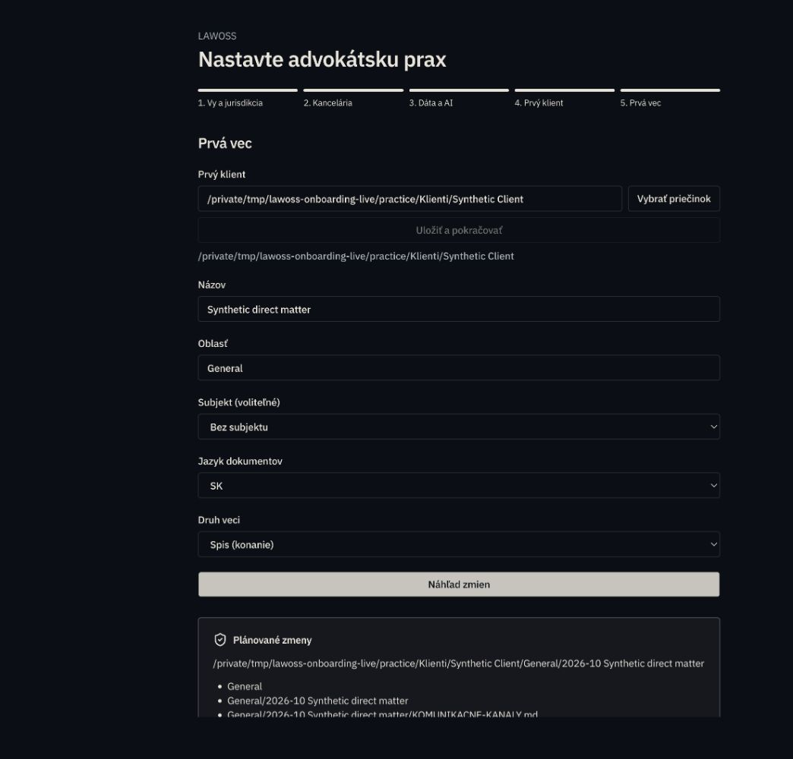
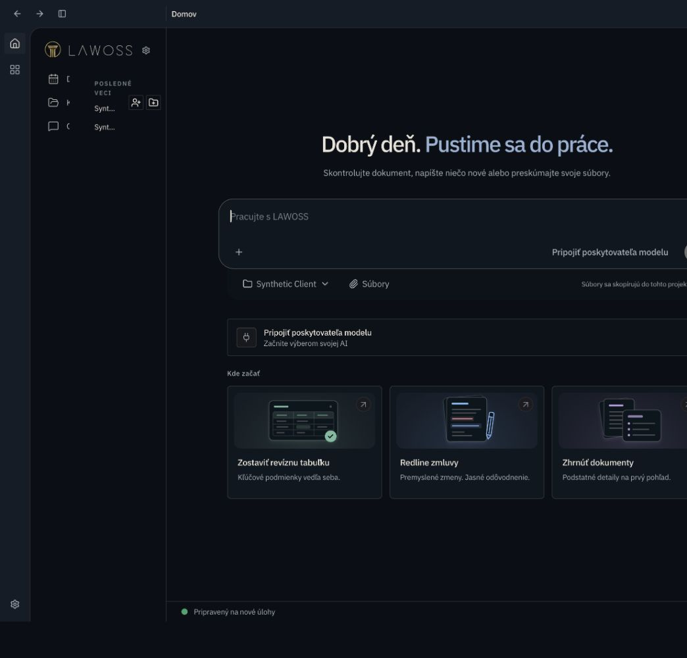

# LAWOSS onboarding #85: implementovaný rozsah

Implementačný záznam k [koordinačnému PR #85](https://github.com/Omni-Legal-Products/lawOSS-like-SK-CZ/pull/85) nad integráciou LAWOSS. Neopisuje návrh ani nenahrádza rozhodnutia v koordinačnom repozitári. Zachytáva hotové správanie a jeho hranice k 3. októbru 2026.

## Onboarding a bezpečný zápis

- Natívny onboarding má päť krokov: identita, kancelária, AI, klient a vec. Uložený stav sa obnoví po návrate do aplikácie; bočný panel vedie na rovnaké akcie pre klienta a vec.
- Plánovač vytvára novú kanceláriu, klienta, subjekt alebo vec. Vec používa samostatný `kind` `contentious` alebo `non_contentious`, oblasť, jurisdikciu, dátum a voliteľný subjekt. Priečinok existujúcej oblasti sa znovu použije, šablóna karty veci a nakonfigurované priečinky kancelárie zostanú zachované.
- Konverzia existujúceho klienta je aditívna. Klasifikátor odmieta konflikt, kanceláriu, vec, symlink a neúplný strom. Zápis vytvára len chýbajúce položky a nikdy neprepisuje originál.
- Režim `map` iba navrhne a následne mimo klienta uloží pamäťový profil. Overuje vybraný zdroj pamäte, identity anchor a nezmenený zdroj pred každým zápisom. Neudeľuje nové oprávnenia mimo potvrdeného runtime kroku.
- `trial_clone` vytvorí oddelenú skúšobnú kópiu so značkou trial, binárne kopíruje zdroj bez zmeny originálu a potom na kópiu aplikuje konverzný plán. Prenos a obnova pokrývajú aj binárne súbory väčšie než 4 MiB.

Každý zápis vychádza z kanonického, nemenného náhľadu. Server uloží hostiteľský ticket s fingerprintom, aplikácia potvrdzuje iba jeho `id`, fingerprint a `confirm: true`, nikdy zoznam operácií od klienta. Žurnál je mimo koreňa, má obsahovo viazanú identitu, zaznamenáva zámer pred vytvorením položky a umožňuje `finish` alebo konzervatívny `rollback`. Dokončený ticket už recovery nevráti späť. Po `finish` registruje klienta obyčajné idempotentné `apply`.

Kontroly cesty, symlinkov, identity a zámku pre rovnaký koreň zužujú preteky na dôveryhodnom lokálnom súborovom systéme. Nemôžu vytvoriť atómový snapshot proti nepriateľskému operačnému systému alebo súborovému systému.

## Kancelária, pamäť a runtime

Kancelária nie je samostatný workspace. Klient je registrovaný workspace a subjekt alebo vec zostávajú jeho kanonickým podpriečinkom, takže jedna klientská registrácia nevytvára paralelné workspaces. Zmena klienta v profile vymaže vybraný subjekt, vec a trial stav. Server odmieta nekánonické a symlinkované scope cesty.

Pre potvrdeného klienta môže hostiteľ pridať jediný externý grant `Office/*`. Rozsah je zámerný: runtime synchronizácia číta `Office/okf.config` pre client path, standing authorization a kontroly úniku mien. Grant neobsahuje rodičovský vault, iného klienta ani súrodeneckú kanceláriu.

Režim `outside` používa app-owned externé úložisko pre profil pamäte, OpenCode konfiguráciu, skills a commands. Kontrola proti OpenCode 1.18.29 potvrdila externé skill a command cesty bez zápisu do pripojeného klienta. Runtime synchronizácia drží session vo vybranej veci, ale zachováva klientsky workspace a jeho potvrdené externé oprávnenia.

## Server, desktop a prenos

Host-only endpointy poskytujú classify, plan, apply a recover. Persistovaný profil, ticket, receipt a runtime konfigurácia prežijú nový proces po načítaní serializovanej konfigurácie. Poškodený ticket sa odmietne pred zápisom. Režim mapovania uchováva metadata mimo klienta; pripojený existujúci klient sa registruje s `appFiles: outside` bez inicializácie jeho vlastného `.opencode`.

Desktop pred štartom runtime odovzdá výber externého app storage a natívny bridge prenáša registrovaný klientsky workspace aj konkrétny priečinok veci. IPC typy, session synchronizácia a route state nevracajú používateľa z veci do nesúvisiaceho workspace.

## Hranice a ďalšie overenie

PR #88 ostáva samostatný rozsah pravidiel AI a nie je splnený týmto onboardingom. Safari MCP vrátil `Transport closed`, preto Safari kompatibilita nie je overená. Kontrola v Codex Browser prešla nad syntetickou kanceláriou: Office, klient, subjekt, oba druhy veci, návrat z natívnych AI nastavení, obnova náhľadu po reload/reštarte a opakovaný vstup z bočného panela. Pri šírke 860 px nebol horizontálny overflow. Fixture nemá bežiaci modelový engine, takže polling enginu hlásil nedostupnosť; tento priechod nedokazuje odpoveď modelu. Žiadny poskytovateľ ani platená inferencia sa neaktivovali.

Zabalený lokálny build ešte podlieha izolovanej štartovacej kontrole. Nainštalovaná aplikácia ani produkčný profil neboli zmenené. Zmiešaný import workspace zostáva pre outside odmietnutý, pretože môže kombinovať aplikačné a dokumentové zápisy. Cloudové placeholdery, všetci poskytovatelia cloudu a odolnosť proti výpadku napájania nie sú akceptačne overené.

## Overenie

Node 24.19.0, pnpm 11.4.0, Bun 1.4.2. Testy používajú syntetické údaje.

| Kontrola | Výsledok |
|---|---|
| `pnpm --dir apps/app test` | 1 141 pass, 0 fail |
| `pnpm --dir apps/server test` | 1 363 pass, 15 skip, 0 fail |
| `pnpm --dir lawoss/okf test` | 206 pass, 0 fail |
| `pnpm --dir lawoss/okf-pamat test` | 605 pass, 0 fail |
| `bun test lawoss/okf-handoff/` | 43 pass, 0 fail |
| `pnpm --dir apps/desktop test` | 251 pass, 1 skip, 0 fail |
| Typecheck app, server, Electron, OKF a pamäte | PASS |
| Build oboch prenosných CLI balíkov | PASS |
| `pnpm --dir apps/app test:i18n` | PASS, 5 665 EN kľúčov, SK/CS/DE úplné |
| `git diff --check`, root AGENTS/CLAUDE | PASS |

Prvý serverový beh mal timeout štartu reálneho OAuth sidecar testu. Izolovaný test opakovane prešiel a následný celý serverový beh bol zelený. Po poslednom úzkom doplnení návratového subjektu boli znovu overené API testy a typecheck.

Pokrytie zahŕňa klasifikáciu, stale tree, kolízie, recovery a rollback, binárny trial clone, mapovanie bez zápisu originálu, serverový trvalý ticket, scope profilov, presný Office grant, klientsku registráciu po recovery, externé app storage a scoped sessions.
