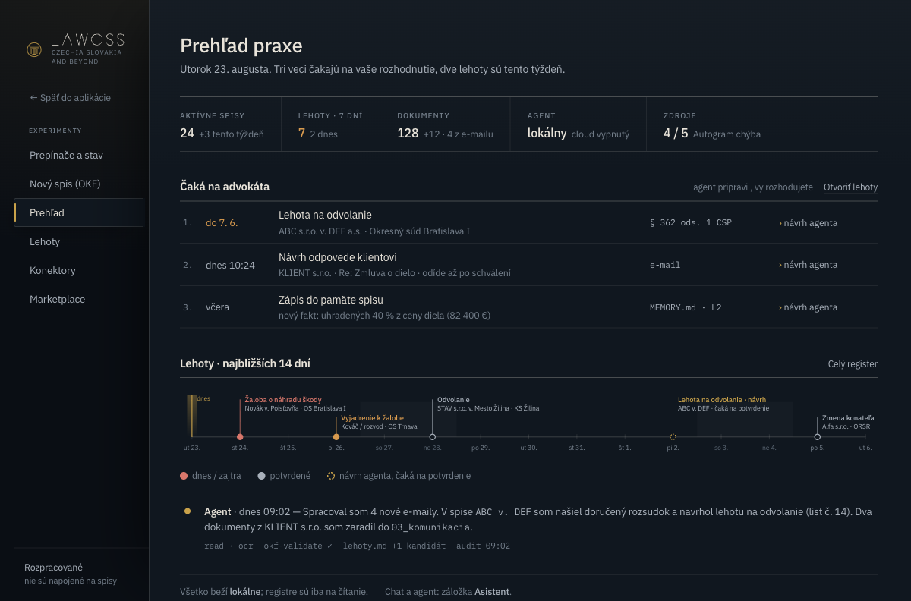
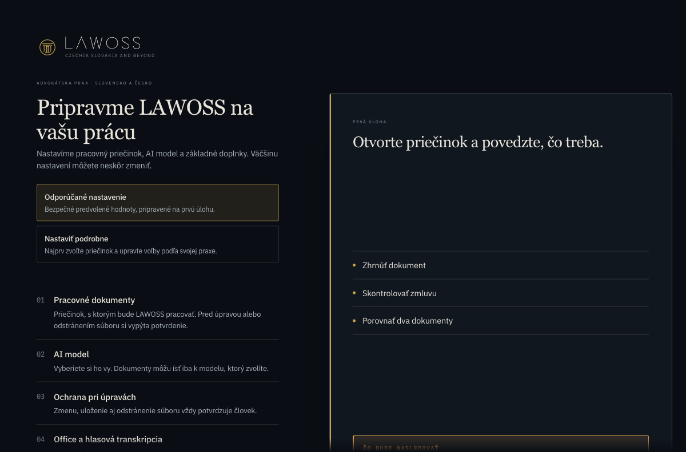

# Upstream sync v0.1.18 — 2026-09-10

Merge upstream release `v0.1.18` (`336270d65493b1591a6ef2e836da369dca36b637`) into LAWOSS `ec0f4c1`, preserving the ancestry for future release merges. Authorized by the maintainer; follows the existing upstream-sync workflow in AGENTS.md.

Preserved: LAWOSS token overrides, fonts, default dark theme, logos and application name, experimental navigation and routes, SK/CZ locales, onboarding, document-author preference, OKF and memory modules, updater destinations and existing Word add-in changes. The only change inside existing LAWOSS-owned application modules is accepting and displaying upstream onboarding startup phases. New upstream dark dock artwork is replaced with the existing LAWOSS icon.

Adopted: realtime voice, document recovery and live Office editing, media previews, Evals, German localization and system-language detection, MCP OAuth fixes, provider validation, packaging fixes and the release's OpenCode 1.18.29. SK/CZ retain their documented English fallback; the i18n check verifies supplied placeholders and does not claim these partial locales are complete.

## Verification

Node 24.13.0, pnpm 11.4.0, macOS ARM64. The host's Node 26 failed to build better-sqlite3; installation succeeds with Node 24.

| Check | Result |
|---|---|
| `pnpm install --frozen-lockfile` | Pass under Node 24 |
| `pnpm typecheck` | Pass |
| App unit tests | 438 pass |
| Server unit tests | 576 pass, 2 skipped |
| Desktop unit tests | 104 pass, 1 skipped |
| Desktop Electron IPC typecheck | Pass |
| i18n check | Pass; EN/DE complete, SK/CZ partial with fallback |
| `pnpm test:e2e` | Pass with bundled OpenCode 1.18.29 first on PATH; system OpenCode initially timed out |
| OKF tests | 14 pass |
| OKF memory tests | 415 pass |
| `pnpm build` | Pass; renderer, Word add-in, Electron bridge (108 methods), server dependencies and plugin bundles verified |
| Browser visual checks | LAWOSS dark overview and Slovak onboarding inspected |
| Built Electron launch | LAWOSS window and local server started; no renderer console errors on inspected screen |
| `git diff --check`, AGENTS/CLAUDE equality | Pass |

Desktop startup still reports HTTP 404 for existing LAWOSS architecture-download destinations. These destinations are preserved rather than replaced with upstream distribution. Live paid voice, microphone permissions and signed installer/update behavior were not exercised. Build reports upstream bundle-size/browser-externalization warnings.

## Visual evidence

The overview contains existing demonstration data, not live matter records.

Merge to `dev` remains subject to the repository's required review and CI; no release was published as part of preparing this sync.
