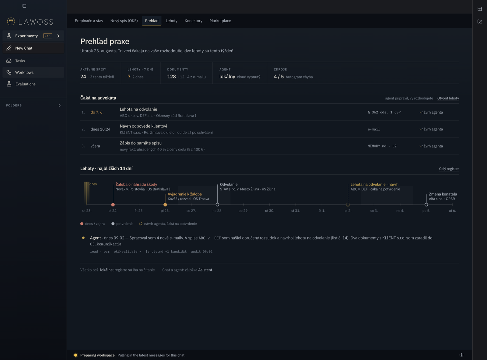
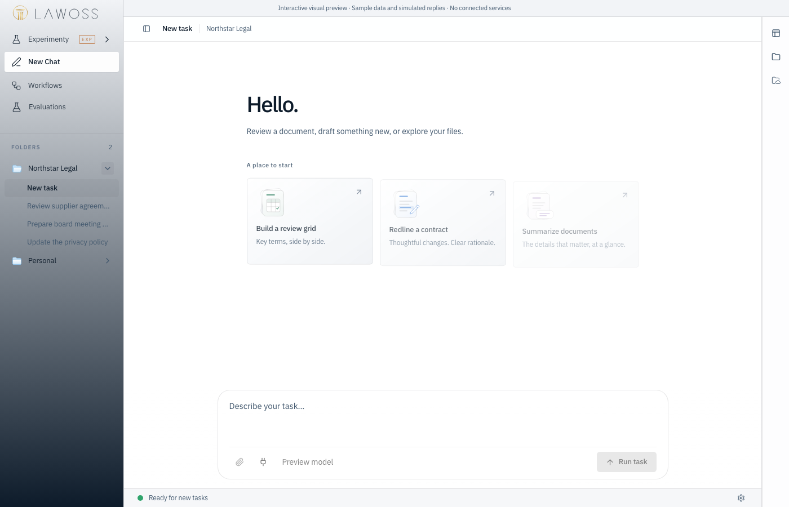
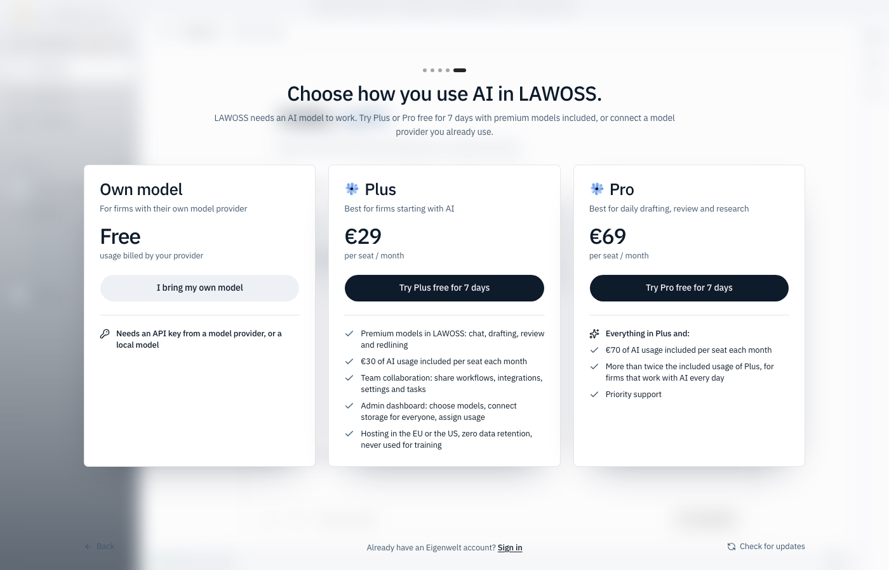

# Upstream sync v0.1.21 — 2026-09-17

Merge upstream release `v0.1.21` (`a4edd4b`) into LAWOSS `790a86c`, preserving the ancestry for future release merges. The release includes v0.1.19 and v0.1.20: 22 upstream commits, 291 files. Authorized by the maintainer; follows the upstream-sync workflow in AGENTS.md. Sync was chosen before the open pull request batch so that the drift to upstream does not grow further.

Preserved: LAWOSS branding and logo B, token overrides and fonts, experimental navigation and routes, SK/CZ locales, LAWOSS onboarding, document-author preference, hidden commercial surfaces (`account`, `recorder`, `firm-hub`, `trial-notice`, LegalMemory quick connect), OKF and memory modules, Autogram card, updater destinations and release customization.

Adopted: one shared MCP connector store with server probing and OAuth fixes, file actions and grouped tool activity, detached-window file sidebars, model output limits and image/PDF support from their source, sending locked while no AI provider is connected, Tasks pane with notifications (local only), file storage integrations for Memory Drive (local scope, without Box), and Bun 1.4.2 across CI and release workflows. `opencodeVersion` stays `v1.18.29`.

## Conflicts

Six textual conflicts, all resolved by keeping both sides:

| File | Resolution |
|---|---|
| `README.md` | LAWOSS README kept. The only upstream change was Bun 1.4.2+, now reflected in `docs/lawoss-build-pre-testerov.md`. |
| `apps/app/src/i18n/locales/en.ts`, `de.ts` | LAWOSS `autogram.*` keys followed by the new upstream keys. |
| `apps/app/src/react-app/domains/session/artifacts/artifact-panel.tsx` | Document author from local preferences plus upstream `localReadOnly` and `saveActions`. |
| `apps/app/src/react-app/domains/settings/shell/settings-page.tsx` | `"appearance"` and the new `"notifications"` tab. |
| `apps/app/src/react-app/shell/session-route.tsx` | Recorder reset and `location.key` dependency plus the upstream Tasks pane keep-open window. |

Every LAWOSS line added to the 21 files changed on both sides is still present after the merge, except the intentionally extended settings tab list. The downstream guards listed in `PATCHES.md` were re-checked in the merged tree.

## Downstream change in this sync

Upstream added a DCO check (`.github/workflows/dco.yml`, `--check-merge-commits`). No LAWOSS commit carries `Signed-off-by`, so the check would fail every fork pull request once it reaches `dev`; because it runs on `pull_request_target`, it would not run on this sync PR itself. The job now runs only in `eigenweltlabs/legalwork` (one `if:` line, recorded in `PATCHES.md`). Contributions sent upstream must still be signed off with `git commit -s` per upstream `CONTRIBUTING.md`.

## Verification

Node 24.19.0, pnpm 11.4.0, Bun 1.4.2, macOS ARM64.

| Check | Result |
|---|---|
| `pnpm install --frozen-lockfile` | Pass |
| `pnpm typecheck` | Pass |
| App unit tests (`bun test tests/`) | 603 pass, 0 fail |
| Server unit tests (`bun test src`) | 845 pass, 22 skipped, 1 fail: `managed-opencode-db.test.ts` hit the 5 s timeout during the full run; rerun alone 9/9 pass |
| Desktop unit tests | 110 pass, 0 fail |
| Desktop Electron IPC typecheck | Pass |
| i18n check | Pass |
| OKF tests | 14 pass |
| OKF memory tests | 441 pass, 2 fail — the same two `e2e.test.ts` cases (`[sk]`/`[cz] cely tok`) fail on unchanged `dev`; open PR #75 changes that test |
| `pnpm test:e2e` | Pass with the bundled OpenCode 1.18.29 first on PATH (the system CLI is 1.18.31) |
| `pnpm build` | Pass; renderer, Word add-in, Electron bridge (109 methods), packaged server dependencies and OpenCode plugins verified |
| Built Electron launch | LAWOSS window (dark theme, logo B, Experimenty, new Tasks entry) and local server started, inspected over CDP with an isolated home |
| Web visual preview (`session-preview.html`) | LAWOSS logo B, experimental navigation and upstream Workflows/Evaluations render; plan screen inspected |
| `git diff --check` on the resolved files | Pass |

Desktop startup still reports HTTP 404 for the existing LAWOSS architecture-download destinations, as in v0.1.18. Not exercised: Eigenwelt sign-in, firm task sync, file storage providers, signed installer and update behavior. Build reports the upstream bundle-size warnings.

## Upgrade note: connectors move on first start

On its first start v0.1.21 moves MCP connectors into a shared row of `~/.config/legalwork/runtime.sqlite` (`__global_mcp__`, upstream #136). It clears them from the per-workspace rows, and **deletes them from each workspace's `opencode.json` and from the global `~/.config/opencode/opencode.json`**. Consequences for testers:

- MCP servers listed in the global OpenCode config disappear from the standalone `opencode` CLI.
- Going back to a pre-sync LAWOSS build shows no connectors, because older builds do not read the shared row.

A desktop smoke test must therefore not run against a real profile: `LEGALWORK_ELECTRON_USERDATA` alone is not enough, because the server reads `~/.config/legalwork` and recovers workspaces from it. The launch above used a separate `HOME`, `XDG_CONFIG_HOME`, `XDG_DATA_HOME`, `XDG_STATE_HOME`, `XDG_CACHE_HOME` and `LEGALWORK_DESKTOP_DISABLE_WORKSPACE_RECOVERY=1`.

## Visual evidence

The built Electron screenshot shows the existing LAWOSS demonstration data. The other two come from the upstream visual preview harness with sample data. None shows live matter records.

## Decisions applied in this sync

Decision MČ 2026-09-17: remove paid Eigenwelt paths, keep what works locally.

1. **Plan screen** (`ai-plans-overlay.tsx`, upstream #155) is hidden as `CommercialSurface "ai-plans"`. Before the guard it was the unskippable last onboarding step and a gate over the app while no model works, and because `applyBrandName()` rewrites `LegalWork` to `LAWOSS` it offered "Premium models in LAWOSS" for €29/€69 per seat. Without the screen the onboarding step `"ai"` would never finish, so a LAWOSS effect finishes it immediately; the own model is connected under Settings → AI Providers or from the composer notice.
2. **Tasks** (upstream #154) stay, local only. `apps/server/src/lawoss/commercial-services.ts` turns off firm sync, firm members and the sign-out wipe unless `LAWOSS_EIGENWELT_FIRM_SERVICES=1`. Without this guard, every local write is queued and a later Eigenwelt sign-in (even just for models) would upload all local tasks, notes and attachments.
3. **File storage** (upstream #131, #142, #148) stays with local scope: SMB, WebDAV, S3-compatible, Azure Blob, GCS, SFTP, FTP/FTPS with the user's own credentials. Team connections via Eigenwelt are off on the server; Box is hidden because every token exchange and refresh goes through the Eigenwelt OAuth broker, unless a firm sets its own `LEGALWORK_STORAGE_BOX_OAUTH_URL`.

Upstream server tests still exercise the Eigenwelt paths: `apps/server/bunfig.toml` preloads `test-preload-lawoss.ts`, which sets the variable for the test run only.

Still visible until open PR #65 is rebased and merged: trial and log-in buttons in the composer notice, the Eigenwelt entry in the providers dialog, the premium upsell and free-tier dialogs. Remaining English copy mentions Eigenwelt in the new-task dialog and in Settings → Notifications ("New and assigned tasks"); SK/CZ translations should avoid it.

Merge to `dev` remains subject to the repository's required review and CI; no release was published as part of preparing this sync.
